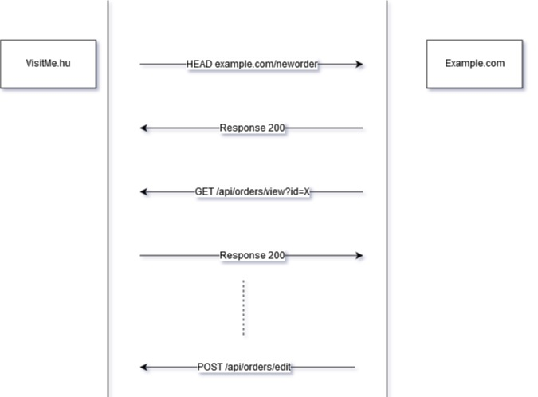

Documentáció
===

## Rövid leírás

A VisitMe™ magyarország egyik legnagyobb ételrendeléssel foglalkozó weboldala. Jelen dokumentáció abban nyújt fejlesztői segítséget, hogy rendeléseket az éttermek saját rendeszerűkben tekinthessék meg.

## Folyamat és regisztráció

A rendszerünkbe két információt kell eltárulnunk.
1. Hogy ön milyen URI-ra (Callback URI) kivánja a rendelésekről az értesítéseket
2. Egy titkos kulcsban (Secret Key) is meg kell állapodnunk a hitelesség miatt. Ezt ön választhatja meg, de legalább a 32 karakter erősen ajánlott.

A rendelésekről való értesítés REST API-n keresztül történik, és nagy vonalakban a következő folyamatábra vázolja az eseményeket.

1. A rendelésről való értesítéseket egy HTTP kérésen keresztül küldjük el a külső szoftverhez. Ezt mindig HEAD metódus segítségével valósítjuk meg. A rendelés azonosítója az __X-Visitme-Order-Id__ HTTP fejlécben található meg.
2. Amennyiben minden rendben ment és 200-as válaszkódot kapunk, __abban az esetben a rendszerünk a rendelést megtekintetnek tekinti!__ Innentől kezdve már nem a mi fellelősségünk az, ha a rendlést pl az étterem alkalmazottai nem tekintik meg. A megfelelő belső értesítésekről már önnek kell gondoskodnia.
3. Egy GET metódus segítségével, lekérheti a rendelés adatait. A rendelés azonosítóját GET paraméterként kell átadni a Secret Key-t pedig egy __X-Visitme-Auth__ HTTP fejlécben.
4. [OPCIONÁLIS, de ajánlott] Egy rendelés sorsáról két féleképpen dönthet, vagy sikeresnek vagy sikertelennek jelöli meg. Amennyiben egy rendelést nem jelöli sikertellennek (visszamondotnak) 13 óra alatt, a rendszer automatikusan teljesítettnek tekinti. __Innentől kezdve a rendelés már nem módosítható.__

## Implementáció

A publikus API endpoint (YAML formátumban) OpenAPI specifikációnak megfelelően dokumentáltuk.

[OpenAPI dokumentáció](openapi/api-documentation.yaml).

## Implementáció után

Amennyiben az implementáció a kívánt formában megtörtént, kérjük jelezze felénk az info[kukac]visitme.hu e-mail címen. Kérjük küldje el nekünk:

1. a callback URI-t (csak HTTPS protokoll az elfogadható)
2. egy kívánt secret key-t (lehetőleg UUID formátumban, vagy egyéb véletlen generált legalább 32 karakter hosszú stringet)
3. az IP címet/címeket ahonnan API hívásokat kezdeményez

### Tűzfal beállítások

Teljesen normális az, hogy tűzfal szabályt állít be arra, hogy kiszűrje a fölösleges kapcsolatokat egy adott endpointra. A VisitMe jelenleg az alábbi IP címről/címekről küld ki értesítéseket:

* 92.119.123.42

Amennyiben valamilyen WAF vagy egyéb tűzfal szoftvert használ, kérjük ezen IP címe(ke)t engedje át.

### Secret key több étterem esetében

Abban az esetben, ha több étterem ugyan azt a szoftvert használja, a Secret Key minden esetben lehet ugyan az, amennyiben ez az authentikációt segíti.

### Meg nem tekintett rendelések ellenőrzése

Bár a rendszereink magas rendelkezésre állással bírnak, sajnos hálózati problémák vagy egyéb szerver problémák felléphetnek, ezért a rendelésről való értesítés nem érkezik meg az étteremhez. A rendelés leadtával a rendelés méta információi (mivel fizettek, azonosítója, rendelés leadásának időpontja) egy másodlagos és átmeneti adatbázisba kerül, a gyakori műveleteket innen végezzük. Ezt hívjuk order managernek. Egy rendelés esetén, az order manager bizonyos idő után (6 perc) felhívja automatikusan az éttermet telefonon, 8 és 16 perc elteltével pedig e-mailt küld a VisitMe support felé, akik innen manuálisan átveszik az irányítást.
Amennyiben a külső rendszerbe való feltöltés nem sikerült (nem kaptunk 200-as válaszkódot), akkor azt az order manager 13 órán keresztül, percenként megismétli a kérést, de szeretném kiemelni, az emberi beavatkozás hamarabb megtörténik.

Mindezektől függetlenül létezik API endpoint, amiből a meg nem tekintett rendelések azonosítóit, ki lehet olvasni.
